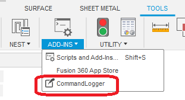
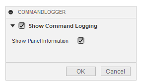

# ***Fusion360  CommandLogger***
This is an add-in for the Autodesk software "Fusion360".

Displays a log of commands manipulated in the GUI in a TextCommands.

***
## Installation:
Please follow the instructions [here](https://knowledge.autodesk.com/support/fusion-360/troubleshooting/caas/sfdcarticles/sfdcarticles/How-to-install-an-ADD-IN-and-Script-in-Fusion-360.html).

## Usage
+ Launch the add-in.
+ A command button will be added to the "ADD-INS" panel.

+ Press the button to display the dialog.
+ "Show Command Logging" should be checked.Each time the command is used "Command name: command ID" appears in the TextCommands palette.

  + Check "Show Panel Information" to also show the panel information containing the command to be executed. This should be useful for add-in developers.

  + This is looking for the CommandDefinitionID registered in the panel, not the actual panel information that was executed. Therefore, the information may not be accurate.

## Action:
Confirmed in the following environment.
+ Fusion360 Ver2.0.9512
+ Windows10 64bit Pro , Home

## License:
MIT

## Acknowledgments:
+ Thank you everyone in the [Japanese forum.](https://forums.autodesk.com/t5/fusion-360-ri-ben-yu/bd-p/707)
