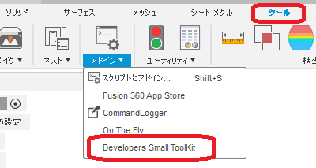
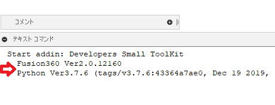
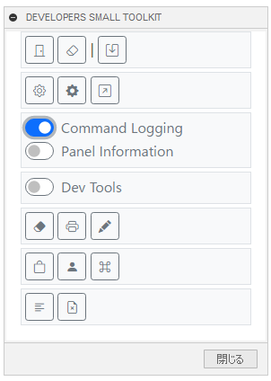

# ** Developers_Small_ToolKit **

これは、オートデスクソフトウェア「Fusion360」のアドインです。

通常のユーザーにはほぼ無意味な、Fusion360 API 開発者向けの小さな工具箱です。

---

## インストール :

インストールする際は、zip ファイルをダウンロード/展開後 "Developers_Small_ToolKit" フォルダをアドインとして登録してください。

アドインの登録は、[こちら](https://kantoku.hatenablog.com/entry/2021/02/15/161734)の手順に従ってください。

## 使用法 :

アドイン起動後は、画面右にドッキングして表示されます。又、"ツール" - "アドイン" 内に "Developers Small ToolKit" コマンドが追加されるため
クリックする事でモーダレスダイアログが表示されます。
モーダレスの為、ダイアログを表示したままでも通常も作業が行えます。

アドイン起動時には Fusion360 と内部で使用されている Python のバージョンを出力します。

各コマンド出力される結果については、ほぼ全てテキストコマンドウィンドウに表示されます。

- Close all docs:　開かれているドキュメントを全て**保存せず**閉じます。
- Remove Custom Graphics: 全てのカスタムグラフィックスを削除します。
- Export TextCommands List: TextCommands(txt)のコマンドリストをファイルに保存します。

- Open CustomPost Folder: カスタムされた製造ポストファイル(cps)のフォルダーを開きます。
- Open InstallPost Folder: インストールされた製造ポストファイル(cps)のフォルダーを開きます。
- Open Post Library WebSite: Post Library のウェブサイトをブラウザで開きます。

- Command Logging: 実行されたコマンド名とコマンド ID を出力します。

  - Panel Information: コマンドのログと共にパネル情報を出力しますが、現在は正しくない情報を出力する可能性もあります。

- Dev Tools: パネル用デベロップツール

- Window Clear: 出力先をクリアします。
- Dump CommandDialog Info: 表示されているコマンドダイアログ情報を出力します。
- Dump Entity Paths: 選択されているエンティティ ID を出力します。(テキストコマンド用)

- Open Cache Folder: ローカルキャッシュフォルダーを開きます。
- Open User Directory: ユーザーディレクトリーを開きます。
  - 'JSLoadedScriptsinfo'　が、登録されたスクリプト/アドイン管理ファイルです。
- Open Active Command Resource Folder: 実行中のコマンドダイアログのリソースフォルダを開きます。

## 注意 ：

- 未完成の為、今後も変更されます。
- テキストコマンドを多数使用している為、将来的に機能しなくなるものも有ると思われます。

## アクション :

以下の環境で確認しています。

- Fusion360 Ver2.0.12160
- Windows10 64bit Pro , Home

## ライセンス :

MIT

## 謝辞 :

- [日本語フォーラム](https://forums.autodesk.com/t5/fusion-360-ri-ben-yu/bd-p/707)の皆さん、ありがとう。
